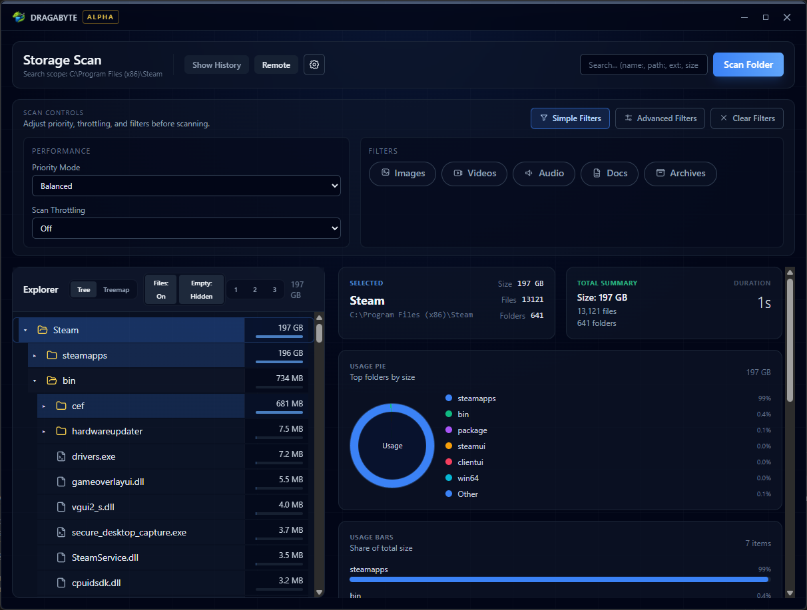

<p align="center">
	
</p>

# Dragabyte

<p align="center">
	
</p>

Dragabyte is a desktop storage analysis app that turns disk usage into clear, actionable insights. It is built for speed, transparency, and clean-up workflows that scale from power users to IT teams.

**Status:** Alpha — core UX and scanning workflows are in active development, and features may change rapidly.

> [!WARNING]
> Alpha builds can change quickly. If you rely on a specific workflow, keep the app pinned to a known version.

## Contents

- [At a Glance](#at-a-glance)
- [Who It’s For](#who-its-for)
- [Core Workflows](#core-workflows)
- [Quick Start](#quick-start)
- [Project Structure](#project-structure)
- [Feature Status](#feature-status)
- [Design Principles](#design-principles)
- [Scripts](#scripts)
- [Landing Page Hosting](#landing-page-hosting)
- [Tech Stack](#tech-stack)

## At a Glance

- **Fast scans** with live progress and prioritization controls.
- **Visual breakdowns** using treemap, pie, and bar views.
- **Actionable cleanup** with large-file focus and deep filters.
- **Audit-friendly** views with history shortcuts and per-item details.

### Demo videos

**Scan workflow**

https://github.com/user-attachments/assets/7f791466-d7d0-40ba-8794-5d1fedefe014

**Bulk rename workflow**

https://github.com/user-attachments/assets/51457e7e-b5b9-42b2-9f5f-58fbaa410f7b

## Who It’s For

- Power users who want immediate, no-nonsense disk visibility.
- IT teams preparing cleanup, audit, or migration workflows.
- Anyone who wants storage insights without waiting on slow scans.

## Core Workflows

1. **Scan a folder** and watch usage populate live.
2. **Explore results** in a tree view or switch to visual charts.
3. **Pinpoint waste** using filters, search tokens, and top files.
4. **Inspect details** per item before taking action.

## Quick Start

### Prerequisites

- Node.js (LTS)
- Rust toolchain
- Tauri prerequisites for your OS

#### Linux build dependencies

- `libgtk-3-dev`
- `libayatana-appindicator3-dev`
- `libwebkit2gtk-4.1-dev`
- `webkit2gtk-driver` (for WebDriver testing)
- `xvfb` (for headless CI or windowless runs)

### Run the app

1. Install dependencies.
2. Start the Tauri dev build.

```
npm ci
npm run tauri:dev
```

<details>
<summary>Advanced setup notes</summary>

- Install OS-specific Tauri prerequisites before the first build.
- If build tooling fails, verify your Rust toolchain is up to date.

</details>

### Build a release

```
npm run tauri:build
```

## Feature Status

### Ready

- Local folder scanning with live progress updates.
- Tree-style explorer with expandable folder breakdowns.
- Treemap, pie, and bar visualizations for space usage.
- Largest files list (top 10).
- Per-item details modal.
- Scan history shortcuts.
- Scan performance controls (priority + throttling).
- Optional Windows Explorer context menu integration.
- Integrated file operations (move, rename, delete, duplicate, new folder).
- Open scans in a dedicated window.
- Advanced filters (extensions, name contains, size range, age range, path contains, regex).
- Advanced search tokens (name, path, extension, size, regex).
- Remote Dashboard for managing headless instances over TCP.
- Remote file preview (limit 5MB).
- Professional reports (PDF, Excel, HTML, CSV).
- Auto-updater.
- Linux bundles (deb/rpm/appimage).

### Planned

#### Search & Cleanup

- Advanced file search by size, age, type, and metadata.
- Duplicate file and folder detection.
- ZIP archive searching.
- Bulk actions: multi-select move, delete, archive.

#### Reporting & Automation

- Email-ready report generation.
- Task scheduler integration.
- Reusable search templates and scheduled scans.

#### File System Insights

- NTFS details (compression, permissions, hardlink awareness).
- Long-path support.
- Multithreaded scanning for large datasets.

#### Planned Milestones

- [ ] Duplicate detection and safe review flow
- [x] Exportable reports (PDF, CSV, HTML)
- [ ] Scheduled scans and reusable templates

## Design Principles

- **Clarity over clutter:** views are focused and purposeful.
- **Speed first:** scanning and navigation should feel instant.
- **Confidence for action:** every cleanup step is explainable.

> [!NOTE]
> Scan speed varies by disk type, permissions, and directory size.[^perf]

## Project Structure

The desktop app and landing page are separate npm workspaces. They share the root lockfile, development tools, and assets.

| Path | Contents |
| --- | --- |
| `apps/client/` | React frontend, Tauri/Rust app and CLI, scan tests, and client configuration |
| `apps/landing/` | Static promotional page and its Vite configuration |
| `assets/` | Shared Dragabyte logo and app screenshot |
| `scripts/` | Versioning and verification tools |

Install once at the repository root with `npm ci`. Run the commands below from that directory. The app frontend uses port 5173; the landing page uses 5174. The app continues to read Vite environment files from the repository root.

## Scripts

| Script | Purpose |
| --- | --- |
| `npm run dev` | Run the app frontend on port 5173. |
| `npm run tauri:dev` | Run the desktop app with its frontend. |
| `npm run dev:landing` | Run the landing page on port 5174. |
| `npm run build` | Build both frontends. |
| `npm run build:app` | Build the app frontend into `apps/client/dist/`. |
| `npm run build:landing` | Build the static site into `apps/landing/dist/`. |
| `npm run preview` | Preview the built app frontend on Vite's default port 4173. |
| `npm run preview:landing` | Preview the built landing page on port 4174. |
| `npm run tauri:build` | Build desktop release bundles in `apps/client/src-tauri/target/release/bundle/`. |
| `npm run cli -- .` | Explore the repository root in the terminal. |
| `npm run cli:build` | Build the standalone CLI. |
| `npm run typecheck` | Type check both workspaces. |
| `npm run lint` | Lint both workspaces. |
| `npm run test:scan` | Run the scan result checks. |
| `npm run test:version` | Check version bumps across workspaces, lockfiles, and Snap. |
| `npm run cli:test` | Run Rust scanner, terminal, and management tests. |
| `npm run sync:version:check` | Check workspace, lockfile, Rust, and Snap versions. |

Use either `npm run dev` or `npm run tauri:dev` for the app frontend; both use port 5173. The landing page can run alongside either. Browser previews do not provide the native file operations of the desktop app.

The landing build can be served from a static host at a domain root or subdirectory. CI builds both frontends and uploads `apps/landing/dist/` as the `landing-page` artifact. Desktop packaging includes only `apps/client/dist/`. No deployment domain is configured.

## Landing Page Hosting

The [Landing Image workflow](.github/workflows/landing.yml) builds and smoke-tests a Linux x86-64 Nginx image, then publishes it to `ghcr.io/pureportal/dragabyte-landing`. Pull requests build and test without publishing. Pushes to `main` and manual runs on `main` publish `latest`; every published build also has a `sha-<full-commit>` tag. Tag runs publish the Git tag, such as `v0.7.4`, without moving `latest`.

After a successful publishing run:

```sh
docker pull ghcr.io/pureportal/dragabyte-landing:latest
docker run -d --name dragabyte-landing --restart unless-stopped -p 127.0.0.1:8080:80 ghcr.io/pureportal/dragabyte-landing:latest
```

Open `http://localhost:8080/`, or point your HTTPS reverse proxy at port 8080. The container serves the site at `/` on port 80 and includes a health check. Use a SHA tag or the digest from the workflow summary to pin a deployment.

Publishing uses the workflow's `GITHUB_TOKEN` with `packages: write`. The GHCR package must be public for anonymous pulls; for a private package, authenticate with `docker login ghcr.io -u YOUR_USERNAME` using a personal access token (classic) with `read:packages`. See [GitHub's registry access documentation](https://docs.github.com/en/packages/working-with-a-github-packages-registry/working-with-the-container-registry). Release tags created by the release workflow's `GITHUB_TOKEN` do not trigger another workflow; run Landing Image manually on that tag if a version tag is needed.

To build and test locally with a running Linux container engine and Node.js 24:

```sh
docker build --platform linux/amd64 -f apps/landing/Dockerfile -t dragabyte-landing:local .
node scripts/verify-landing.mjs dragabyte-landing:local
```

The build context is the repository root so the image can use the workspace lockfile and shared assets. The smoke test starts a temporary container, checks health, page content, CSS, images, navigation anchors, and a missing-page response, then removes the container.

## Tech Stack

- Tauri 2.0 + Rust
- React + TypeScript
- Tailwind CSS + shadcn/ui
- TanStack Router + TanStack Query

## Linux Support

Dragabyte ships Linux bundle targets via `apps/client/src-tauri/tauri.linux.conf.json`. The Linux config is merged using JSON Merge Patch during builds, allowing Linux-specific bundle settings without affecting Windows or macOS builds.

## Terminal & Headless Management

Build the standalone terminal executable without desktop dependencies:

```sh
npm run cli:build
```

Run `apps/client/src-tauri/target/release/dragabyte-cli` (`.exe` on Windows):

```sh
dragabyte-cli /data
dragabyte-cli scan /data --json
dragabyte-cli serve --bind 127.0.0.1:4799
```

The interactive explorer has live size bars, folder navigation, filtering, sorting, largest files, cancellation, and refresh. With no path it scans the working directory. Piped output produces a text report. Folder totals show apparent file sizes; the disk meter shows volume space.

The CLI and management server run without a desktop session or Tauri, including on Linux servers over SSH. Desktop builds remain separate and use the same scanner and management protocol. Use `DRAGABYTE_TCP_TOKEN` for authenticated remote management and an SSH tunnel for encrypted access.

See [terminal usage and architecture](docs/terminal.md) and [verification results](docs/terminal-verification.md).

[^perf]: Performance can differ significantly between SSDs, HDDs, network drives, and restricted folders.
